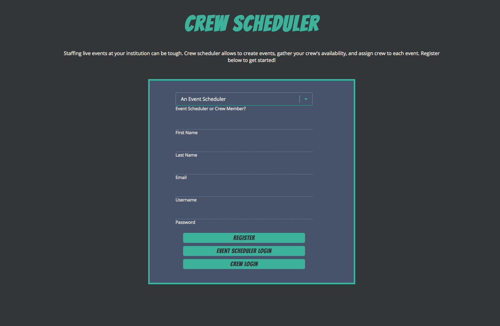
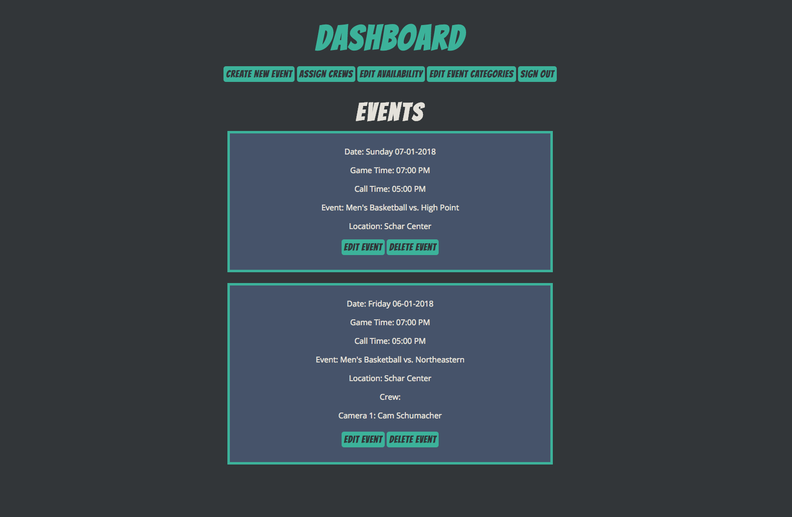
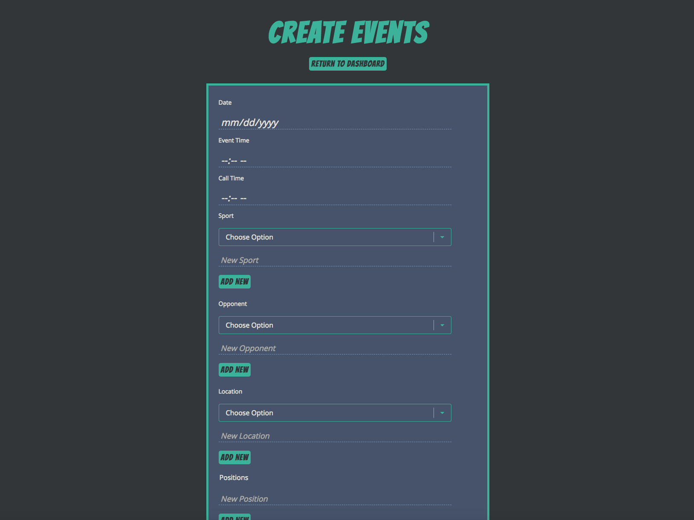
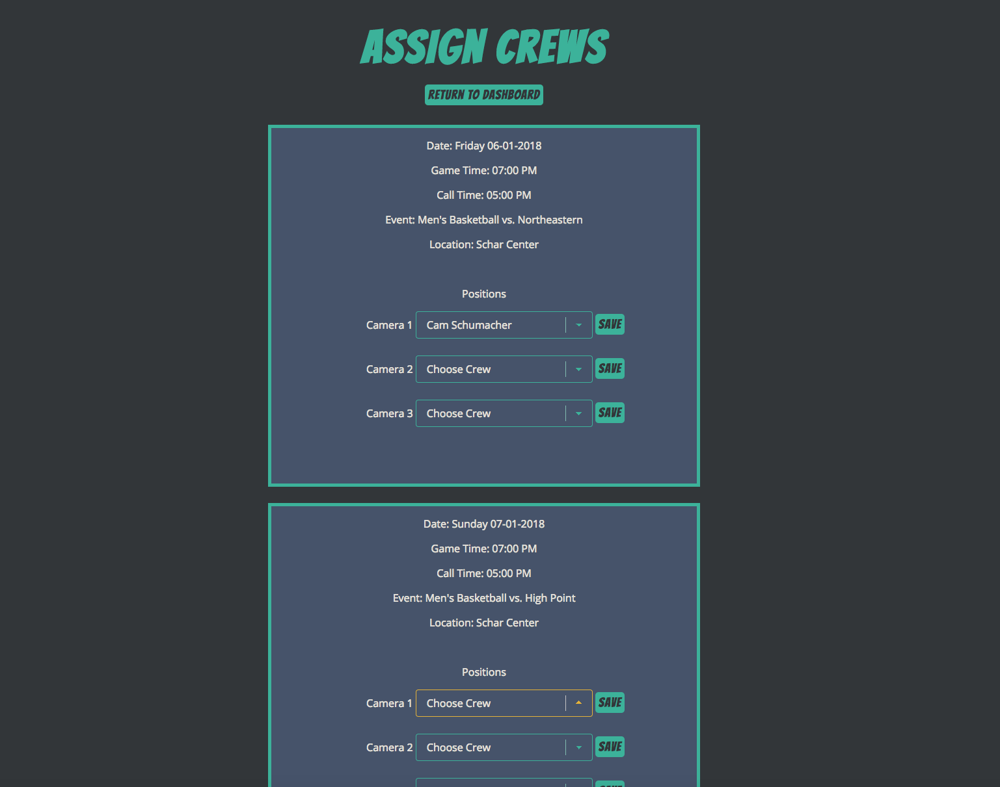
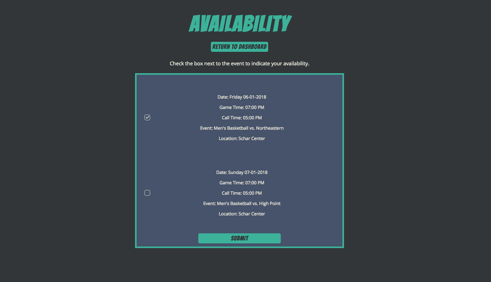

<h1>Crew Scheduler App</h1>

<h2>Live Site</h2>
<a target="_blank" href="https://fierce-wildwood-43879.herokuapp.com/">https://fierce-wildwood-43879.herokuapp.com/</a>

<h2>Summary</h2>

In my previous career, I managed a student group of 30-40 students to staff up to 100 live productions of sporting events throughout the year. Managing availability and scheduling for several events with an array of needs, I wanted to develop an web application that would make this process easier.

Crew Scheduler allows as user to create all events for the year, and then have students log in to update their availability. When availability is in, the admin can go through an assign crew to events, and go back and edit as needed.

<h2>Screenshots</h2>
<h3>Registration Page</h3>
	
<h3>Dashboard</h3>
	
<h3>Event Creation</h3>
	
<h3>Crew Assignment</h3>
	
<h3>Availability Page</h3>
	

<h2>API Endpoints</h2>
<h3>/api/sports</h3>

Contains all sports that can be used when creating events.

GET, POST, PUT, DELETE functionality.

Model:
	{
		id: 5adf6e93f3db2f00143ae4dd,
		sport: Men's Basketball,
	}

<h3>/api/opponents</h3>

Contains all opponents that can be used when creating events.

GET, POST, PUT, DELETE functionality.

Model:
	{
		id: 5adf6e93f3db2f00143ae4dd,
		opponent: North Carolina,
	}

<h3>/api/locations</h3>

Contains all locations that can be used when creating events.

GET, POST, PUT, DELETE functionality.

Model:
	{
		id: 5adf6e93f3db2f00143ae4dd,
		location: Schar Center,
	}

<h3>/api/positions</h3>

Contains all positions that can be assigned when creating events.

GET, POST, PUT, DELETE functionality.

Model:
	{
		id: 5adf6e93f3db2f00143ae4dd,
		position: Camera 1,
	}

<h3>/api/events</h3>

Contains all events created in the scheduler.

GET, POST, PUT, DELETE functionality.

Model:
	{
		id: 5adf6e93f3db2f00143ae4dd,
		date: Friday 06-01-2018,
		time: 07:00 PM,
		call: 05:00 PM,
		sport: Men's Basketball,
		opponent: North Carolina,
		location: Schar Center,
		positions: [
			Camera 1,
			Camera 2,
			Director,
			Replay Operator
		]
	}

<h3>/api/availability</h3>

Contains availability for each created event.

GET, POST, PUT, DELETE functionality.

<h4>/api/availability/:eventId</h4>

GET availabilty for a specific event with the event ID

<h4>/api/availability/:user/:eventId</h4>

DELETE user availability from event with event ID and user info.

Model:
	{
  		id: 5adf6e69f3db2f00143ae4da,
        eventId: 5adf6e34f3db2f00143ae4d9,
        availableCrew: [
            "Michelle Manzo",
            "John Doe",
            "Cameron Camera"
        ]
	}

<h3>/api/crew</h3>

Contains crews for each created event.

GET, POST, PUT, DELETE functionality.

<h4>/api/crew/:eventId</h4>

GET crew for a specific event with the event ID

<h4>/api/crew/:id/:position</h4>

Reassigning new crew with PUT functionality automatically removes the old value.

Model:
	{
  		id: 5adf6e69f3db2f00143ae4da,
        eventId: 5adf6e34f3db2f00143ae4d9,
        crew: [
        {
        	position: Camera 1,
        	crewMember: Michelle Manzo
        },
                {
        	position: Camera 2,
        	crewMember: Cameron Camera
        },
                {
        	position: Camera 4,
        	crewMember: John Doe
        }

<h2>Technology Used</h2>
<ul>
	<li>HTML</li>
	<li>CSS</li>
	<li>JavaScript</li>
	<li>jQuery</li>
	<li>Node.js</li>
	<li>Express</li>
	<li>Mocha</li>
	<li>MongoDB</li>
	<li>Mongoose</li>
	<li>Mocha</li>
	<li>Chai</li>
	<li>Passport.js</li>
	<li>bcrypt.js</li>
	<li>faker.js</li>
	<li>moment.js</li>
</ul>	

<h2>Author</h2>

This project was created by Michelle Manzo.

